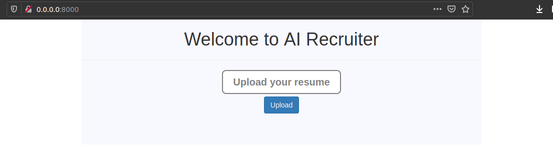

# VO - AI Recruiter [ IBM Hack Challenge 2020 ]


## AI Recruiter Demo


## Prerequisites

You'll need the following:
* [IBM Cloud account](https://console.ng.bluemix.net/registration/)
* [Cloud Foundry CLI](https://github.com/cloudfoundry/cli#downloads)
* [Git](https://git-scm.com/downloads)
* [Python](https://www.python.org/downloads/)
* [Google cloud account](https://cloud.google.com/)
* [Google Vision api](https://cloud.google.com/)


## 1. Clone the sample app

Now you're ready to start working with the app. Clone the repo and change to the directory where the sample app is located.
  ```
git clone https://github.com/tejas100/VO
cd VO

#To run the client side application,to scan the documents. 
cd client 

#ibm-cloud watson assistant and cloud action
cd watson assistant
  ```


## 2. Run the app locally

Install the dependencies listed in the [requirements.txt](https://pip.readthedocs.io/en/stable/user_guide/#requirements-files) file to be able to run the app locally.

You can optionally use a [virtual environment](https://packaging.python.org/installing/#creating-and-using-virtual-environments) to avoid having these dependencies clash with those of other Python projects or your operating system.
  ```
pip install -r requirements.txt
  ```

Run the app.
  ```
python hello.py
  ```

View your app at: http://localhost:8000



As soon as candidate upload his/her resume vision api will return analyzed data, which is then stored into the ibm cloudant db.


## 3. Cloud Actions and watson assistant

Ibm cloud actions will helps to connect watson assistant to ibm cloud cloudent database.

  ```
#ibm-cloud watson assistant and cloud action
cd watson assistant
  ```


